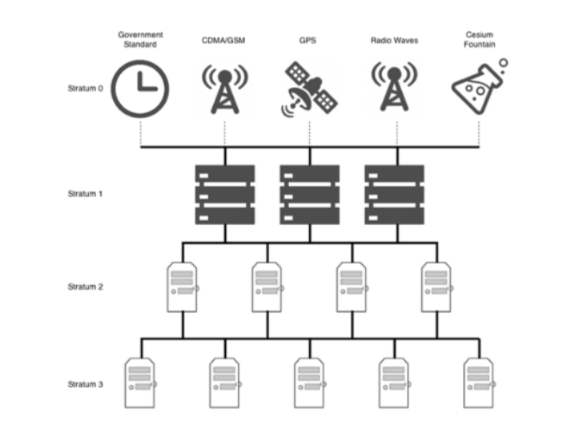

# NTP란 ??

- 네트워크로 연결되어있는 컴퓨터들끼리 시간을 동기화하는데 사용하는 프로토콜이다.
- NTP는 정확한 시간 동기화를 위해 협정 세계시각(UTC)을 사용한다.
- NTP는 UDP 기반으로 동작한다. 또한 NTP는 PC의 Local Time이 아닌 Online Time (실제 시간)
    
    을 받아오는 프로토콜이다.
    

## Stratum이란 무엇인가요 ??

- NTP 프로토콜은 서버와 클라이언트가 아래와 같이 트리 구조로 나타내져있다.
- 따라서 서버와 클라이언트의 계층을 구별하기 위해서 NTP는 Stratum이라는 용어를 사용한다.

- 가장 최상위의 서버를 Stratum 0으로 표현한다. (0은 원자시계를 의미한다)
- Stratum 1,2,3은 정확한 시간으로 동기화하기 위해 Stratum 0으로부터 동기화를 받아온다.

## NTP 통신의 장점

- NTP 프로토콜을 사용하면 데이터의 손실을 방지할 수 있다.
- 로그에 대한 분석에 용이하다.
- 예약된 작업을 정상적으로 가능하게 한다.

## NTP 통신의 단점

- 외부 서버로부터 시간을 동기화 받는 부분으로 인해 보안상의 문제가 취약할 수 있다.
    - 이를 해결하기 위해서 별도의 Time Server를 이용할 수 있다.

---

# Chorny란 ??

- 기존 NTP 프로토콜의 단점을 개선하고자 개발된 시간 동기화 프로토콜이다.

## 무슨 단점을 대체하였을까요 ??

### 1. NTP 초기 동기화 시간

- NTP는 초기 동기화 시간이 오래걸릴 수 있다. 처음에는 네트워크 대기 시간과 시간 오차를 보정 해야 하기 때문에 시간 동기화까지의 시간이 필요하다.
- 하지만 Chrony는 Validation Step같은 알고리즘을 사용해서 초기 동기화 시간을 줄인다.

### 2. 네트워크 대기시간 변동성 (변동성 == 시간의 변화)

- NTP는 네트워크 환경에 따라 네트워크 대기 시간이 변동할 수 있다.
- Chrony는 네트워크 대기 시간을 최소화하기 위해 대기 시간을 정확하게 측정하고 보정하고 보다 정확한 시간 동기화를 달성한다.

### 3. 네트워크 연결 문제

- NTP는 네트워크 연결이 불안정하거나 일시적으로 끊어질 때 시간 동기화의 정확성을 유지하기 힘들다
- 하지만 Chrony는 네트워크 연결이 불안정하거나 일시적으로 끊어진 경우에도 시간 동기화를 유지한다. 그리고 네트워크 연결이 복구되면 최신 시간 정보로 동기화된다.

---

## 그럼 NTP와 Chrony의 차이점이 무엇인가요 ??

### 1. 정확성과 정밀성

- NTP보다 Chrony가 알고리즘을 사용하여 더욱 정확하고 정밀하게 시간을 동기화한다.

### 2. 리소스 사용

- NTP보다 Chrony가 리소스를 덜 사용한다. 따라서 Chrony를 사용하게 되면 CPU 및 메모리 사용을 최소화하여 시스템에 부담을 덜 주면서 정확한 시간 동기화를 사용한다.

### 나머지로는 위에서 나온 단점 대체 부분이 차이점이다 !!!!