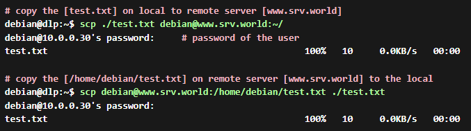
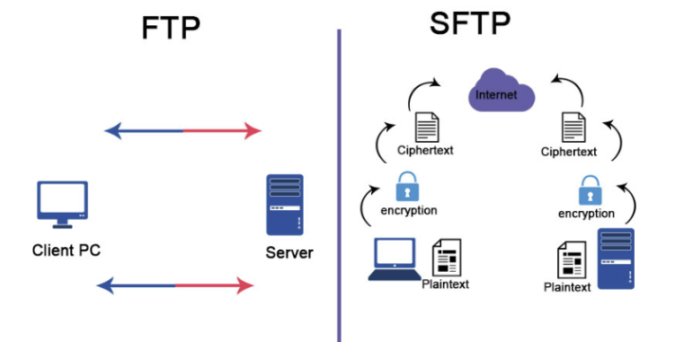

## 1. SCP (Secure Copy)

- 아래는 기본적인 SSH로 File을 전송하는 SCP (Secure Copy)의 예시이다.


- 형식은 아래와 같다.
- SCP [option] Source Destination

## 2. SFTP (SSH File Transfer Protocol)



- SFTP는 기본적으로 활성화가 되어있지는 않다.
- 활성화를 하려면 /etc/ssh/sshd_config에 아래와 같이 설정해야한다.

```bash
vi /etc/ssh/sshd_config

Subsystem    sftp    /usr/libexec/openssh/sftp-server
```

- 아래는 sftp의 사용방법이다.

```markdown
debian@dlp:~$ sftp debian@www.srv.world
debian@www.srv.world's password:     # User의 Password 입력
Connected to www.srv.world.
sftp>

# 접속한 원격 Computer의 현재 디렉토리 위치를 보여준다.
sftp> pwd
Remote working directory: /home/debian

# Local Server의 현재 디렉토리 위치를 보여준다.
sftp> !pwd
/home/debian

# FTP 서버의 현재 디렉토리들을 보여준다.
sftp> ls -l
drwxrwxr-x    2 debian     debian            6 Jul 29 21:33 public_html
-rw-rw-r--    1 debian     debian           10 Jul 28 22:53 test.txt

# 로컬 서버의 현재 디렉토리들을 보여준다.
sftp> !ls -l
total 4
-rw-rw-r-- 1 debian debian 10 Jul 29 21:31 test.txt

# cd 명령어로 디렉터리를 변경한다.
sftp> cd public_html
sftp> pwd
Remote working directory: /home/debian/public_html

# 로컬 컴퓨터의 file을 원격 컴퓨터로 Upload 한다.
# 로컬 컴퓨터의 test.txt를 원격 컴퓨터의 /home/debian/debian.txt로 업로드 한것이다.
sftp> put test.txt debian.txt
Uploading test.txt to /home/debian/debian.txt
test.txt 100% 10 0.0KB/s 00:00
sftp> ls -l
drwxrwxr-x    2 debian     debian            6 Jul 29 21:33 public_html
-rw-rw-r--    1 debian     debian           10 Jul 29 21:39 debian.txt
-rw-rw-r--    1 debian     debian           10 Jul 28 22:53 test.txt

# 이렇게 확인하면 debian.txt가 생긴걸 확인 할 수 있다.
sftp> ls -l
drwxrwxr-x    2 debian     debian            6 Jul 29 21:33 public_html
-rw-rw-r--    1 debian     debian           10 Jul 29 21:39 debian.txt
-rw-rw-r--    1 debian     debian           10 Jul 28 22:53 test.txt

# 원격서버로부터 test.txt 파일을 다운로드 받아온다.
sftp> get test.txt
Fetching /home/debian/test.txt to test.txt
/home/debian/test.txt 100% 10 0.0KB/s 00:00

디렉터리 지울 때는 rmdir
파일을 지울 때는 rm 
```