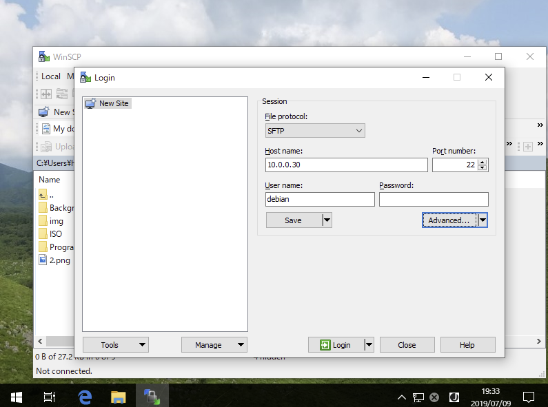
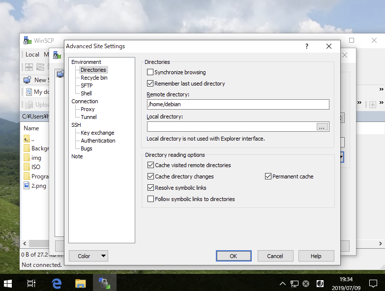
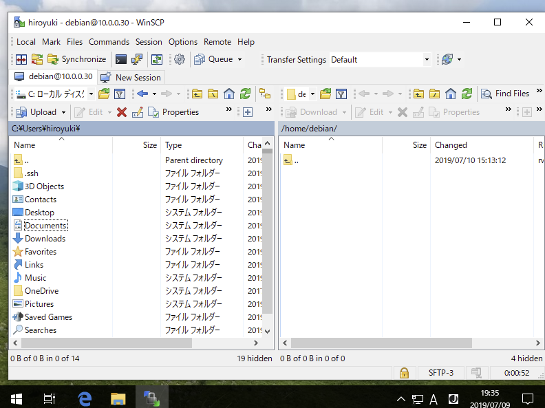

- 리눅스가 아닌 Windows Client에서도 SSH를 사용하여 파일을 전송할 수 있다.
- WinSCP라는 프로그램을 사용해서 설정 해볼 것이다.

### Step 1

- WinSCP를 설치하고 시작하면 다음과 같은 초기창이 나타난다.
- Hostname, Username, Password를 적절히 설정한 후 Advanced..를 클릭한다.

### Step 2

- 좌측 메뉴의 [Directory]에서 로그인 시 초기 위치로 [Remote Directory]와 [Local Directory] 항목을 입력하고 OK를 클릭하여 SSH로 접속한다.

### Step 3

- 로그인이 정상적으로 될것이다.
- 여기서부터는 파일을 Upload하거나 Download 할 수 있다.

