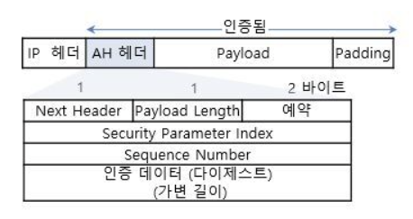

# ESP와 AH

- 암호화 및 무결성 확인을 위한 보안처리 과정을 거친후 데이터를 포장(Encryption)하여 전송하는 데 이떄 포장방식, 즉 Encapsulation  방식은 크게 두가지로 나뉜다.

### ESP와 AH

- 아래에서 각각의 Format(형식)을 알아보자.

---

## ESP

### 1. SPI(Security parameter index)

- 목적지 IP 주소와 조합하여 현재 패킷의 SA값을 표시하며 32Bit이다.
- SA(Security Association)에는 암호화/무결성 확인 알고리즘 종류, 보호대상 네트워크 등의 정보가 포함되어있다.

### 2. 순서번호(Sequence number)

- 각 패킷마다 1씩 증가하는 순서번호이다.
- 패킷의 재생방지를 위하여 사용되며 32Bit이다.
- RFC4303에서는 64Bit의 순서번호도 사용할 수 있도록 규정하고 있다.
- SPI와 순서번호는 암호화시키지 않는다.


### 3. 패딩(Padding)

- 사용된 암호화 알고리즘에 따라 필요한 크기를 맞추기 위하여 추가하는 의미없는 데이터이다.

### 4. 패딩 길이(Padding Length)

- 패딩의 길이를 바이트 단위로 표시하며 8Bit이다.

### 5. 넥스트 헤더(Next Header)

- ESP 헤더 바로 다음의 프로토콜 종류를 표시한다.
- IP 헤더에서 사용하는 프로토콜 필드의 값을 빌려 표시하여 8Bit이다.
- ESP의 필드 중에서 패딩, 패딩길이 및 넥스트 헤더 필드를 합쳐 `ESP Trailer` 라고한다.

### 6. ICV(Integrity check value)

- 데이터의 변조 확인을 위하여 추가하는 Hash코드 값이다.
- 기본적으로는 변할 수 있는 가변적인 길이를 가진다.
- 패킷 인증 및 무결성 확인을 위하여 사용하는 알고리즘에 따라 길이가 달라진다.

```markdown
예를 들어, 

HMAC MD5-96 알고리즘 -> 128bit Hash Code
ESP,AH -> 96bit Hash Code
HMAC-SHA-1-96 -> 160bit Hash Code
```

---

## AH

### 1. 넥스트 헤더 (Next Header)

- AH 헤더 바로 다음의 프로토콜 종류를 표시한다.
- IP 헤더에서 사용하는 프로토콜 필드의 값을 빌려 표시하여 8bit이다.

### 2. 길이 (Length)

- AH의 헤더 길이를 워드 단위로 표시하여 8bit이다.

### 3. SPI(security parameter index)

- 목적지 IP 주소와 조합하여 현재 패킷의 SA를 표시하며 32bit이다.

### 4. 순서번호 (Sequence Number)

- 처음 1부터 시작하여 각 패킷마다 1씩 증가하는 순서 번호이다.
- 패킷의 재생방지를 위하여 사용되며 32bit이다.
- 송신측에서는 반드시 사용해야하며, 수신측에서는 재생방지 기능이 동작할 떄 이 필드를 사용한다.



### 5. ICV(integrity check value)

- Data의 변조 확인을 위하여 추가하는 Hash 코드값이다.
- AH 헤더 앞에 위치하는 IP 헤더 중에서 변동될 수 있는 값 즉, TTL, Checksum, ECN 필드 등을 계산하여  Hash Code 값을 계산한다.

### 6. Data

- 실제로 전다달되는 데이터이며, 보호대상이 되는 원래의 IP 패킷 중에서 Layer 4 이상의 데이터가 위치한다.