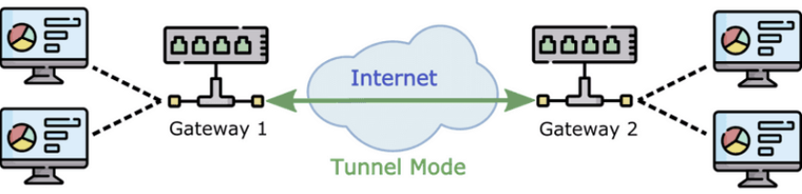

# VPN Type

- IPsec VPN은 원래의 데이터 패킷에 VPN 장비의 새로운 IP 헤더를 추가하는지에 따라서         `Transport`와 `Tunnel` 모드로 구분할 수 있다.

---

## Transport Mode

- 다음 그림과 같이 종단 장비 사이에 직접 IPSEC VPN을 이용한 통신이 이루어지는 경우에는 Transport Mode를 주로 사용한다.
- 그러나 이 경우에도 Tunnel Mode를 사용할 수 있긴 하다.

- ESP 헤더 + Data + ESP 트레일러로 무결성 확인
- 실질적으로 암호화되는것은 Data + ESP Trailer
- Transport Mode를 사용하면 20Byte 길이의 추가적인 IP header를 사용하지 않는 반면, 보안통신을 하는 `두 장비의 IP 주소가 외부에 노출된다`.

---

### Tunnel Mode

- 다음 그림과 같이 종단 장비들이 전송경로 사이에 있는 IPSEC VPN 게이트웨이를 이용하여 통신을 하는 경우에는 Tunnel Mode를 사용하는 것이 일반적이다.

- 순수 IPsec VPN이 아닌, GRE IPsec이나 DMVPN같은 경우에는 앞에 GRE 헤더 20bit가 붙는다.
- GRE 헤더가 암호화 되는것이므로 L3의 정보는 노출되지 않지만 Transport mode보다 패킷이 20bit가 더 커진다는 단점이 있다.