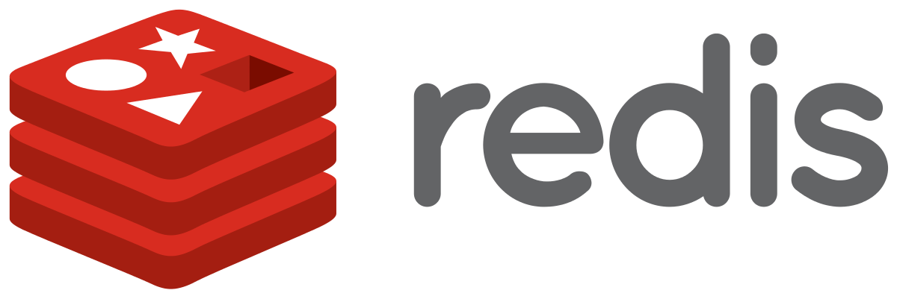

# Redis란 ?

- `Key, Value` 구조의 비정형 데이터를 저장하고 관리하기 위한 오픈 소스 기반의 비관계형 DBMS이다.
- 데이터 베이스, Cache, 메시지 브로커로 사용되며, 인메모리 데이터 구조를 가진 저장소이다.

```markdown
인 메모리 데이터 구조란?

- 디스크가 아닌 주 메모리에 모든 데이터를 보유하고 있는 데이터베이스이다.
- 기존의 데이터베이스는 Disk에 저장되지만, 인 메모리 데이터 구조는 자료 접근이 더 빠르다는
  장점이 있다.
- 하지만 단점은, 매체가 휘발성이라는 것이다. DB 서버 전원이 꺼지면 데이터가 사라진다.
- 그래서 보통은 로그인 세션 같은, 서버가 꺼져서 날아가도 상관 없는 임시 데이터에 주로 쓰인다.
```

### Redis 알아보기 전, Cache Server란?

# Cache Server란?

### ❓기존 DB가 대신 Redis라는 인메모리 데이터구조 저장소를 사용하는 이유❓

- DB가 있지만 Cache 서버를 사용하는 이유는…
- DB는 데이터를 컴퓨터의 물리 디스크에 접근을 하여 사용을 한다.
- 그러므로 서버에 문제가 발생하더라도 데이터가 손실되지 않는다.
- 하지만 Query가 들어올 때 마다, 물리적인 디스크에 접근을 해야하기 때문에 과도한 트래픽을 처리하려면 부하가 많아져서 속도가 대폭 줄어들수도 있다.
- 서비스에 대한 사용자들이 많다면 DB가 과부하 될 수 있기 때문에 중간에 Cache 서버를 도입하여 사용한다. 그 때, Cache로 사용할 수 있는 Cache Server가 Redis인것이다.
- Cache는 한번 읽어온 데이터들을 임의의 공간에 저장하여 다음에 똑같은 Query가 들어오면 임의의 공간에 있는 데이터들을 바로 불러오기 때문에 직접적인 물리 디스크에 영향을 미치지 않는다.

## Cache의 종류

### 1. Look aside

1. 클라이언트가 Server에 요청을 함.
2. 요청을 받은 Web server는 Cache Server에 요청을 받은 Data가 있는지 확인.
3. Cache Server에 Data가 있다면 그 선에서 정리.
4. Cache 서버에 Data가 없다면 Web Server는 Data를 Cache 서버에 저장한 후 결과값을 클라이언트에 반환한다. 
    1. 이떄, Web Server에서 직접적으로 Response 하는게 아닌, Cache로 데이터를 전송한 후에 Cache에서 Response 해주는거임.

### Write Back

1. 처음부터 Web Server는 Cache의 임의의 장소에다가 모든 데이터를 전송한다.
2. Cache 서버에는 Web Server로부터 들어온 데이터들이 임의의 시간동안 저장된다.
3. Cache 서버에 있는 데이터들을 DB로 옮긴다.
4. 이 때, DB에 옮겨진 데이터들을 Cache 서버에서 삭제한다.
    1. Write Back 방식은 DB에 적용되기 전에 Cache 서버에 메모리 공간에 저장되는데, 이 때 오류가 발생하여 Server가 Down되면 메모리가 날아갈 수도 있다는 단점이 있다.

---

# 본격적인 Radis의 특징❗

- Key-Value 구조로 저장되어있기 때문에 Query를 사용할 필요가 없다.
    - SET username "john_doe"
    GET username
- 데이터를 물리적인 디스크에 접근하여 사용하는게 아닌, 메모리에서 처리하므로 속도가 빠르다.
- String,Lists,Sets,Sorted,Hashs 등의 자료구조를 제공한다.
- Single Threads이다.
    - 한번에 하나의 명령어만 처리할 수 있다.

## Redis를 사용할 때 주의할 점

- 서버에 장애가 그에 대한 플랜을 계획해야한다.
- 메모리 관리가 중요하다.
- 싱글 스레드의 특성상, 한 번에 하나의 명령만 처리할 수 있으므 처리가 오래걸리는 Request나 긴 명령어의 Input은 피해야한다.